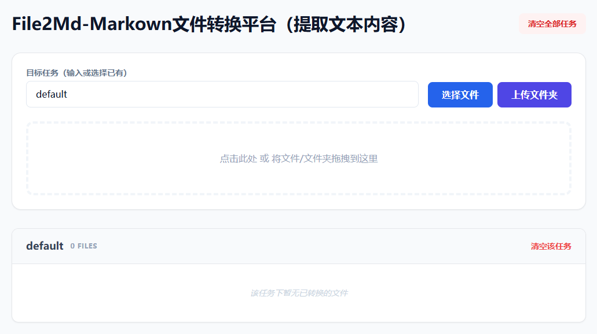

# File2Md-Markown文件转换平台（提取文本内容）
## 概览
github:https://github.com/AylerH/markitdown-fastapi

## 缺点
* 仅可转换文本内容内容；
* 格式可能丢失；

## 优点
* 可转换任意文件为md；
* 启动方便：docker compose一键启动（镜像1G左右）；

# 部署提示
复制.env copy为.env
完成文件配置后，仅需运行 `docker-compose up --build -d`，即可在 `OUTER_PORT` 定义的端口（看.env copy）开始使用。

# 网页访问
前端网页：
```
http://127.0.0.1:OUTER_PORT/
```
首页样式：


后端接口：
```
http://127.0.0.1:OUTER_PORT/docs
```

## 多分支说明
详：分支说明.md
```
backend:仅后端分支;
main:全栈分支
```

## 目录树结构
my_project/
├── app/
│   ├── app.py             <-- 后端逻辑
│   └── static/            <-- 新建文件夹
│       └── index.html     <-- 前端页面
├── requirements.txt
├── Dockerfile
└── docker-compose.yml

# 简要总结：

### 1. 核心功能
*   **批量并行转换**：支持一次性上传多个文件或整个文件夹，高效转换为 Markdown。
*   **多任务管理系统**：支持通过“任务名”对文件进行物理隔离存储，可自由创建新任务或复用已有任务。
*   **全方位文件操作**：
    *   **单文件**：在线下载、单独删除。
    *   **任务级**：一键打包下载任务内所有文件的 ZIP 包、清空特定任务。
    *   **全局级**：一键清理所有历史转换任务。
*   **双模式交互**：前端支持“拖拽上传”与“点击上传”无缝结合。

### 2. 关键技术点
*   **后端驱动**：基于 **FastAPI**，利用其异步特性处理并发上传，并结合 `shutil` 流式写入提高大文件稳定性。
*   **核心引擎**：集成微软 **MarkItDown** 库，实现高保真的文档内容提取与 Markdown 转换。
*   **容器化部署**：通过 **Docker-Compose** 管理，利用 `.env` 实现 **内外端口分离**（`OUTER_PORT` / `INNER_PORT`）及环境变量动态注入。
*   **即时压缩技术**：使用 `zipfile` 与 `StreamingResponse` 结合，实现 **ZIP 内存流式打包**，无需占用额外磁盘空间即可完成批量下载。
*   **前端交互**：采用 **Tailwind CSS** 构建响应式 UI，通过 HTML5 `datalist` 实现智能任务名搜索与输入。

### 3. 解决的痛点
*   **环境依赖复杂**：MarkItDown 需要 Python 环境及各种底层库（ffmpeg, exiftool 等），Docker 镜像化实现了一键部署，环境零污染。
*   **转换碎片化**：解决了原生工具一次只能转一个文件的问题，通过“任务”概念让文件管理井然有序。
*   **下载不便**：避免了转换后手动去服务器找文件的麻烦，前端直接提供批量打包下载功能。
*   **操作门槛**：将命令行工具转化为可视化 Web 界面，点击即用，支持文件夹直接拖入。

### 4. 支持文件类型
得益于 MarkItDown 引擎，本系统支持：
*   **文档**：PDF, Microsoft Word (`.docx`), Excel (`.xlsx`), PowerPoint (`.pptx`).
*   **多媒体**：图片（`.jpg`, `.png`, 自动提取元数据）、音频（`.mp3`, `.wav`, 自动转录文本）。
*   **网页/其他**：HTML 网页、文本文件（`.txt`, `.csv`）、YouTube 视频字幕（需提供 URL）。


# MarkItDown FastAPI

🚀 A simplified and containerized version of [MarkItDown](https://github.com/microsoft/markitdown) running as a FastAPI service, with a RESTful API for file-to-Markdown conversion.

## ✨ Features

- Convert files to Markdown via API
- Upload, list, download, and delete files
- Lightweight Dockerized setup using `docker-compose`
- Interactive API documentation via Swagger UI

## 📸 API Preview

Here’s a preview of the available endpoints exposed via Swagger UI:


You can access the interactive docs at:
http://localhost:5000/docs
> Make sure the app is running using Docker or FastAPI directly.

## 📦 Getting Started
复制.env.example为.env
```bash
git clone https://github.com/Elkhn/markitdown-fastapi.git
cd markitdown-fastapi
docker compose up -d --build
```

## Credits & Inspiration

This project is heavily inspired by [MarkItDown](https://github.com/microsoft/markitdown) developed by Microsoft.
This is **not a fork** but a lightweight custom version built for my own needs, removing parts that were not essential for deployment or containerization.
Respect and thanks to the original developers for their excellent work!